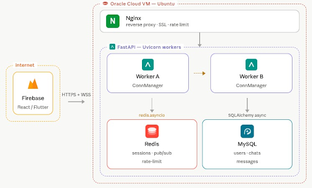
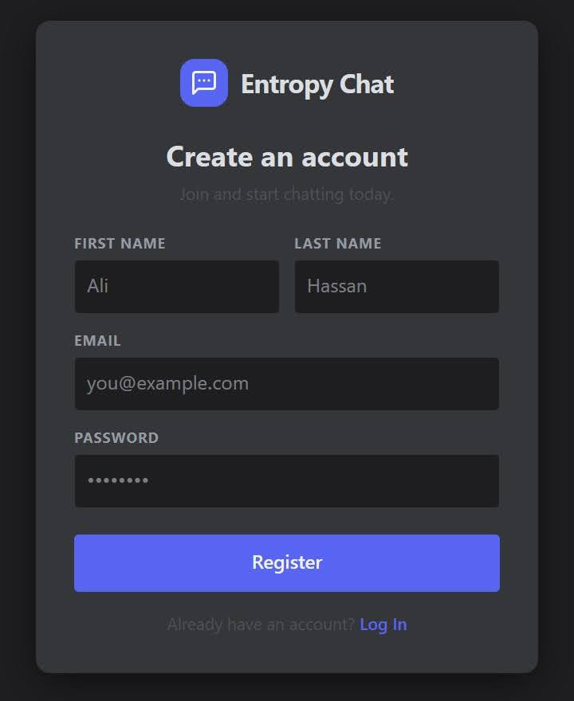
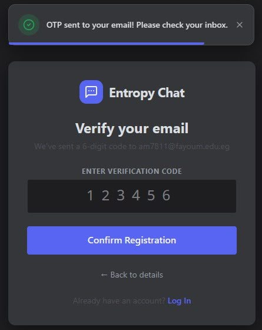
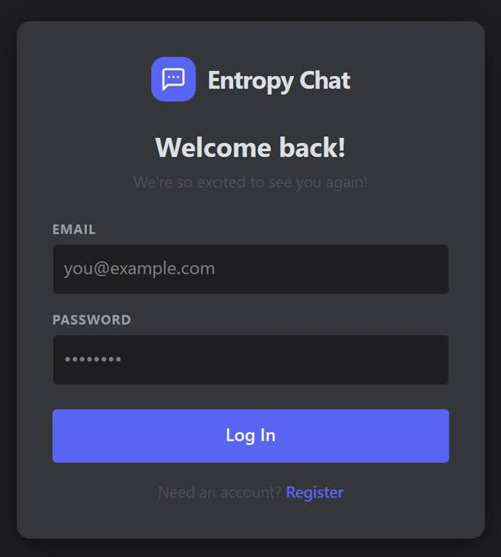
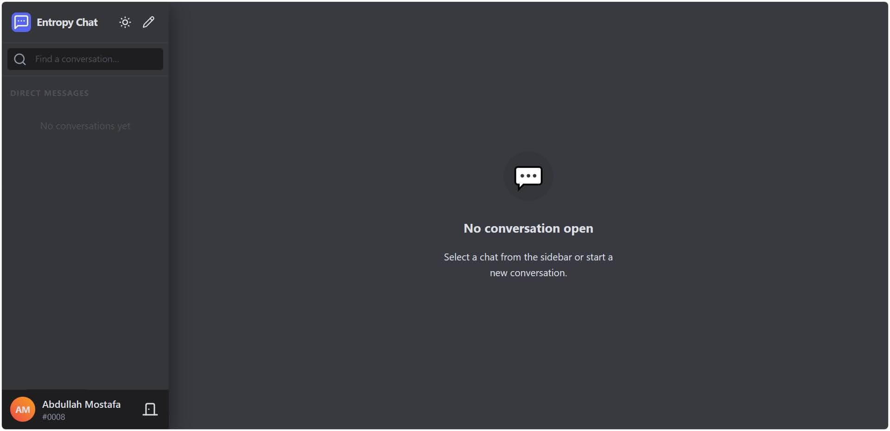
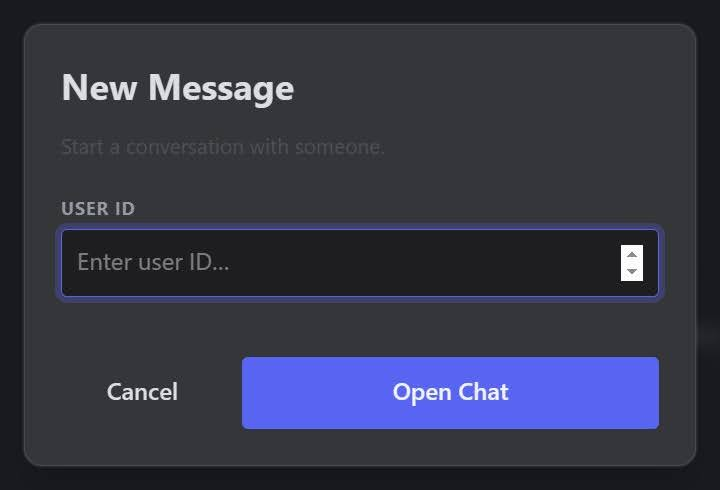
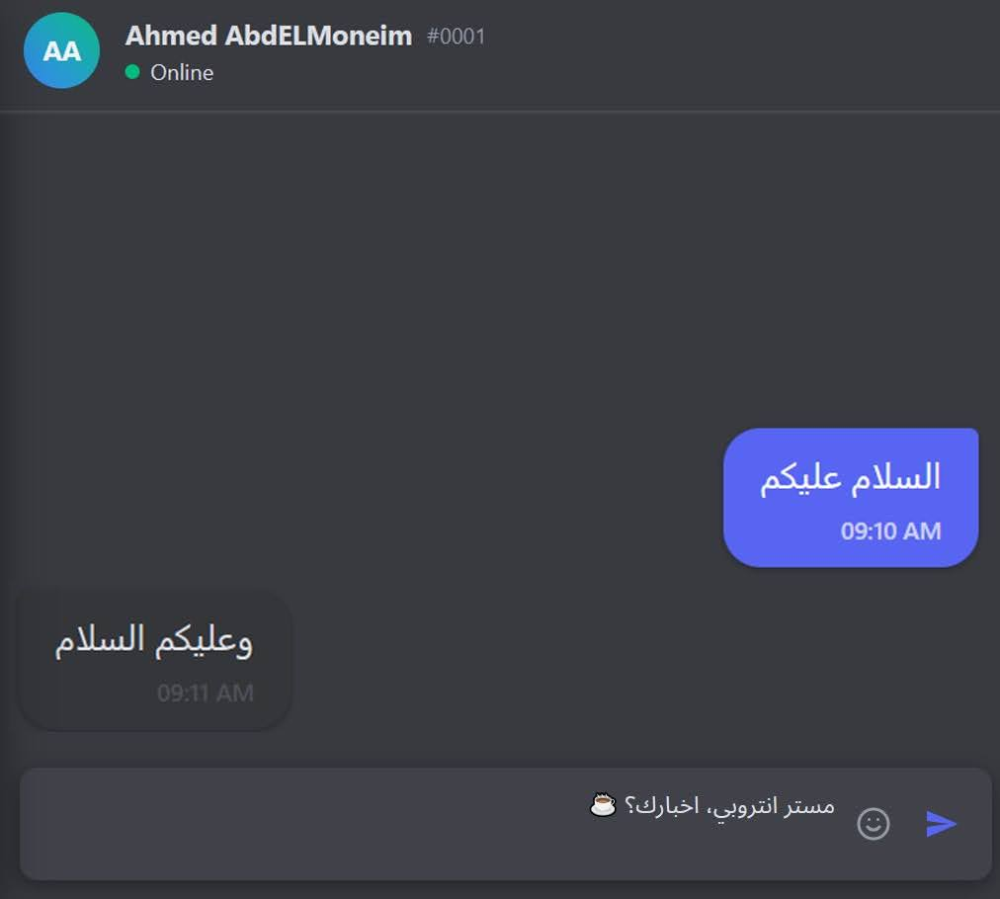
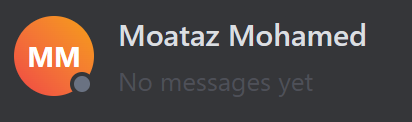

<div align="center">
  
  <h1>💬 Entropy Chat</h1>
</div>

**Live Demo:** [Entropy Chat](https://entropychat-4f269.web.app/) | **Documentation:** [Full Project Documentation](https://docs.google.com/document/d/1d71glQO1k3rfHFJWwQ3a2d74GwEMOw3_LClAimSvEtQ/edit?tab=t.0)

Entropy Chat is a web-based realtime chat application. Built with a decoupled client-server architecture, it features a static Next.js frontend and an asynchronous FastAPI backend. It utilizes WebSocket communication and Redis Pub/Sub to orchestrate real-time messaging across isolated server processes.

## ✨ Features

* **Real-Time Messaging:** Instantaneous, two-way communication using persistent WebSocket connections, eliminating HTTP overhead.
* **Advanced Session Management:** Multi-device synchronization; if a user logs in on multiple devices, all sessions receive real-time updates instantly.
* **Distributed Worker Architecture:** Solves the isolated memory problem of multi-worker environments using Redis Pub/Sub as an Inter-Process Communication (IPC) engine.
* **Rate Limiting & Abuse Prevention:** Custom middleware leverages Redis to track request counts. Exceeding the threshold triggers an IP ban returning HTTP 429 to prevent spam.
* **Secure Authentication Pipeline:** Features an onboarding process including email OTP verification before account creation. Passwords are secured using `bcrypt` via Passlib.
* **Live Presence Indicators:** Tactical visual feedback for typing indicators and online/offline presence using visual status indicator balls.

## 🏗️ Architecture & Workflow

The production environment operates on a fully decoupled infrastructure:

<div align="center">
  
  <h2>Workflow Architecture</h2>
</div>

1. **Frontend:** Hosted statically on Firebase using Next.js/React.
2. **Reverse Proxy:** Nginx handles SSL termination and rate limiting on an Oracle Cloud Ubuntu VM.
3. **Backend API:** FastAPI running via Uvicorn workers.
4. **Cache & IPC Layer:** Redis handles active sessions, OTP caching, active connection counters, and acts as the Pub/Sub message broker.
5. **Persistent Storage:** MySQL handles permanent records utilizing SQLAlchemy Async and the `aiomysql` driver to maintain non-blocking I/O.

### How Redis Pub/Sub Solves Multi-Worker Isolation
Because each Uvicorn worker operates in an isolated memory space, workers cannot natively communicate. Entropy Chat solves this by using Redis as a global mailbox. 
* When a user connects, a lightweight asynchronous task subscribes to a dedicated Redis channel (`user_inbox:{user_id}`).
* When a message is sent, it is published to this specific channel. 
* Redis immediately fans the message out, waking up only the required listener tasks across all workers to deliver the payload via WebSockets, eliminating CPU-heavy database polling.

## 💻 Tech Stack

* **Frontend:** Next.js (React)
* **Backend:** Python, FastAPI
* **Database:** MySQL, SQLAlchemy Async, `aiomysql`
* **Cache & Message Broker:** Redis
* **Email Service:** `aiosmtplib`
* **Deployment:** Oracle Cloud Infrastructure, Nginx, Firebase

## 📸 Interface Preview

<table align="center" style="width: 100%; text-align: center;">
  <tr>
    <td align="center" width="50%">
      <b>Account Registration</b><br><br>
      
    </td>
    <td align="center" width="50%">
      <b>Email OTP Verification</b><br><br>
      
    </td>
  </tr>
  <tr>
    <td align="center" width="50%">
      <b>Secure Login</b><br><br>
      
    </td>
    <td align="center" width="50%">
      <b>Chat Dashboard</b><br><br>
      
    </td>
  </tr>
  <tr>
    <td align="center" width="50%">
      <b>Start New Chat</b><br><br>
      
    </td>
    <td align="center" width="50%">
      <b>Live Real-Time Chat</b><br><br>
      
    </td>
  </tr>
  <tr>
    <td align="center" width="50%">
      <b>Real-Time Typing Indicator</b><br><br>
      
    </td>
    <td align="center" width="50%">
      <b>Live Presence (Offline/Online)</b><br><br>
      
    </td>
  </tr>
</table>

## 🚀 Local Development Setup

To run Entropy Chat locally, you will need Python, Node.js, MySQL, and a local Redis server running.

### 1. Database & Cache Prep
* Ensure your local **MySQL** server is running and create a database for the project.
* Ensure your local **Redis** server is running (usually on `localhost:6379`).

### 2. Backend Setup (FastAPI)
Navigate to the backend directory:
```bash

# Create and activate a virtual environment
python -m venv venv
source venv/bin/activate  # On Windows use: venv\Scripts\activate

# Install requirements
pip install -r requirements.txt

# Start the development server and we can now assign workers number 
uvicorn main:app --port 8000 --host 0.0.0.0 --workers 4
```

Note on Cookie Security for Localhost: To successfully authenticate over localhost (HTTP), you must modify the login endpoint in main.py. Ensure the authentication cookie parameters are set to allow local cross-origin requests:

```Python
response.set_cookie(
    key="session_id",
    value=session_id,
    httponly=True,
    max_age=SESSION_TTL,
    samesite="lax",   # Change to "lax" for local dev
    secure=False      # Change to False for local dev (non-HTTPS)
)
```

### 3. Frontend Setup (Next.js)
Navigate to the userInterface/ directory:
```bash
# Install dependencies
npm install  # or yarn install

# Start the development server
npm run dev  # or yarn dev
```

## 👨‍💻 Creators

**Ahmed AbdELMoneim (Mr Entropy)**

**Abdalla Mostafa (Frontend Man)**

**Moataz M Ali (Diplomats)**

**Ahmed Hassan (BatHassan) 🦇**